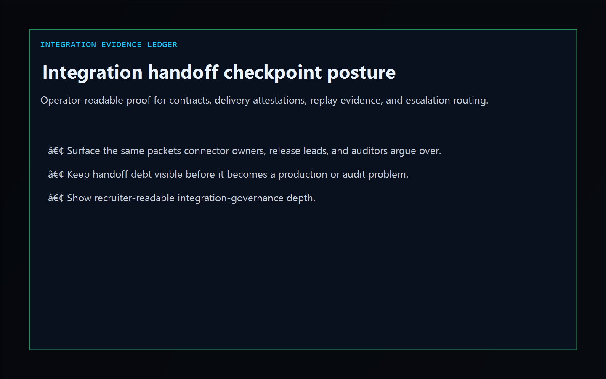
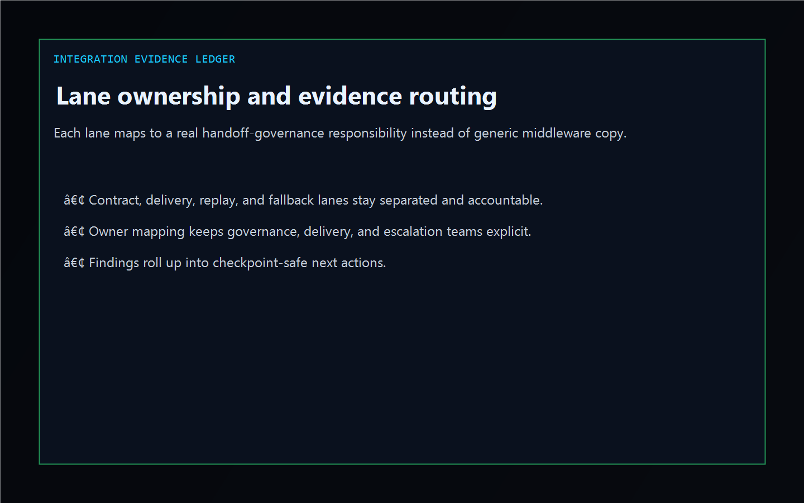
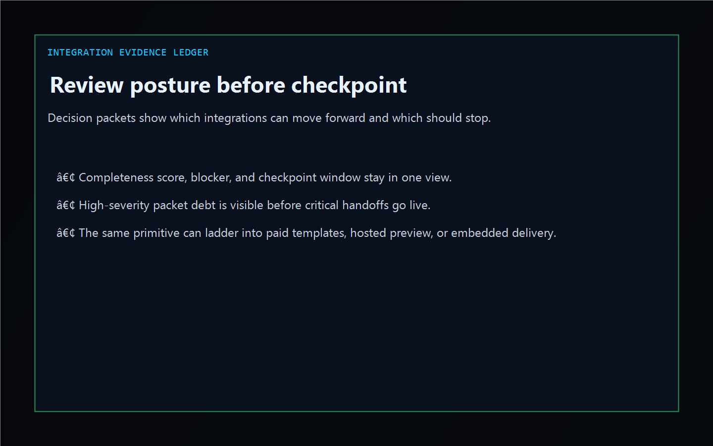

# Integration Evidence Ledger

[](https://github.com/mizcausevic-dev/integration-evidence-ledger/actions/workflows/ci.yml)
[](https://github.com/mizcausevic-dev/integration-evidence-ledger/actions/workflows/pages.yml)
[](https://github.com/mizcausevic-dev/integration-evidence-ledger/releases/tag/v0.1-shipped)

TypeScript control plane for integration governance, missing contract packets, delivery drift, replay evidence, and review-safe handoff routing.

Live surface:

- [handoff.kineticgain.com](https://handoff.kineticgain.com/)

## Why this exists

- Integration launches often split contract proof, delivery evidence, replay posture, and escalation routing across platform, operations, and audit teams.
- Enterprise shops still need one operator-readable picture before a checkpoint or incident review hardens.
- This surface turns synthetic sync and packet exports into lane, gap, and review posture evidence without pretending to be a live integration control plane.

## Why this matters

This repo demonstrates the Workflow / Enterprise Integration evidence-routing primitive for enterprise buyers: contract packets tied to missing proof, stale replay windows, handoff blockers, and checkpoint-safe escalation paths. A B2B buyer would care because integration posture often needs to surface inside operator tools without exposing unsafe middleware systems or write-heavy backends. Kinetic Gain Embedded extends this into security-first in-product analytics for review-aware and evidence-aware workflows, see [kineticgain.com/embedded](https://kineticgain.com/embedded).

## Monetization ladder

- Tier 1 now: public repo, dashboard, analyzer, and docs surface
- Tier 2 planned: paid packet templates, handoff starter packs, and checkpoint checklists
- Tier 3 contingent: hosted preview when product rail and billing are ready
- Tier 4 by engagement: embedded integration-governance and evidence-routing delivery

## Surface map

- `/`
- `/handoff-lane`
- `/evidence-gaps`
- `/review-posture`
- `/verification`
- `/docs`

Structured APIs:

- `/api/dashboard/summary`
- `/api/handoff-lane`
- `/api/evidence-gaps`
- `/api/review-posture`
- `/api/verification`
- `/api/sample`

## Screenshots





## Local usage

```powershell
git clone https://github.com/mizcausevic-dev/integration-evidence-ledger.git
cd integration-evidence-ledger
npm install
npm run verify
npm run prerender
npm run render:assets
```

Start the local server:

```powershell
npm run dev
```

Useful routes:

- [http://127.0.0.1:5524/](http://127.0.0.1:5524/)
- [http://127.0.0.1:5524/handoff-lane](http://127.0.0.1:5524/handoff-lane)
- [http://127.0.0.1:5524/evidence-gaps](http://127.0.0.1:5524/evidence-gaps)

CLI example:

```powershell
npx integration-ledger fixtures/integration-evidence-clean.json --format summary
```

## Release discipline

| Guardrail | Posture |
| --- | --- |
| Data handling | Synthetic, non-customer, non-tenant-identifying handoff and evidence packets only. No live payloads or credentials. |
| Deploy | Static prerender → **https://handoff.kineticgain.com/** (GitHub Pages, [pages workflow](./.github/workflows/pages.yml)) |
| SEO | `robots.txt`, `sitemap.xml`, canonical routes, and crawlable docs included |
| Theme | Dark Kinetic Gain operator shell aligned to the current public dashboard standard |
| Tests | `npm run verify` covers lint, typecheck, vitest coverage, build, demo, and smoke |

## Platform note

This is an independent operator-surface demonstration for teams working with integration and handoff workflows. It is not an official vendor site, SDK, or tenant integration.
